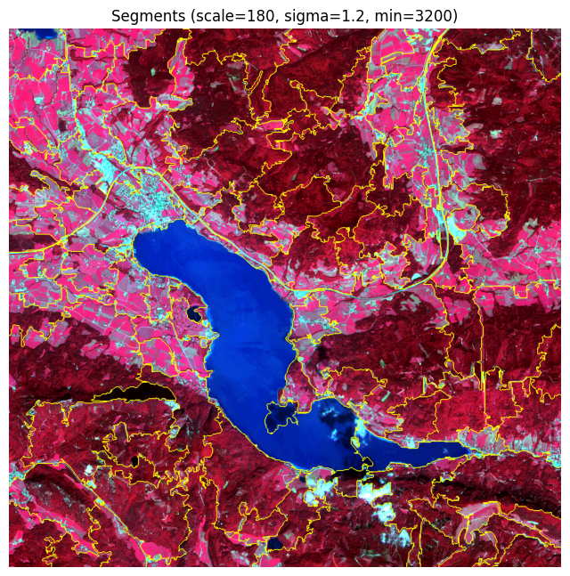

# Object-Based Image Segmentation using the Felzenszwalb Algorithm

This repository demonstrates how **object-based image segmentation** can be performed in Python using the **Felzenszwalb graph-based algorithm**, replicating the **multiresolution segmentation** approach implemented in *eCognition*.  
The workflow applies to a Sentinel-2A subset and aims to delineate meaningful land-cover objects such as **vegetation**, **water**, and **built-up areas**.

---
## Overview

Traditional pixel-based classification methods often ignore spatial context.  
Object-Based Image Analysis (OBIA) overcomes this by grouping pixels into homogeneous objects that represent real-world features.  
In this notebook, segmentation is achieved through the **Felzenszwalb–Huttenlocher algorithm** (2004), implemented in `scikit-image`.
The results are compared against eCognition’s Multiresolution Segmentation using identical data and similar parameters.

---
## Workflow Summary

1. **Load Sentinel-2A subset (6 bands)**  
   - Bands: Blue, Green, Red, NIR, MIR1, MIR2  
2. **Apply layer weights**  
   - (B, G, R, NIR, MIR1, MIR2) = (1, 1, 1, 3, 3, 3)  
3. **Normalize each band**  
   - Per-band 2–98% percentile stretch → 0–1 scale  
4. **Run segmentation**  
   - Algorithm: Felzenszwalb (`skimage.segmentation`)  
   - Parameters:  
     - `scale` = 180  
     - `sigma` = 1.2  
     - `min_size` = 3200  
5. **Visualize results**  
   - False-color composite (NIR–R–G)  
   - Overlay boundaries using `mark_boundaries()`  
6. **Compare with eCognition**  
   - eCognition total objects: 67  
   - Python total objects: 98  
---
## Key Libraries

- `rasterio` – Reading and handling GeoTIFF rasters  
- `numpy` – Array operations and mathematical processing  
- `matplotlib` – Visualization and plotting  
- `geopandas` – Vector data management (optional export step)  
- `scikit-image` – Image segmentation (Felzenszwalb, mark_boundaries)
---

## Reference

Felzenszwalb, P. F., & Huttenlocher, D. P. (2004).  
*Efficient graph-based image segmentation.*  
**International Journal of Computer Vision**, 59(2), 167–181.

